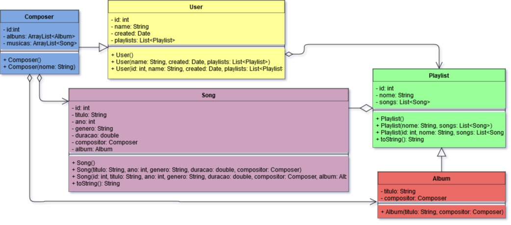

# VP2 - Projeto
	O objetivo desse projeto é criar uma aplicação baseada no spotify, em que o
	usuário cadastrada músicas e pode criar playlists a partir delas, além de poder
	exibir e excluir tanto as músicas quanto as playlists.
	
## Persistência dos Objetos
	Foi utilizado o banco SQLite para armazenar os objetos.
	
## Executar a Aplicação
	Para iniciar a aplicação, execute o arquivo compileRun.sh na raiz do projeto.
		
		bash compileRun.sh
		
## UML das Entidades

	